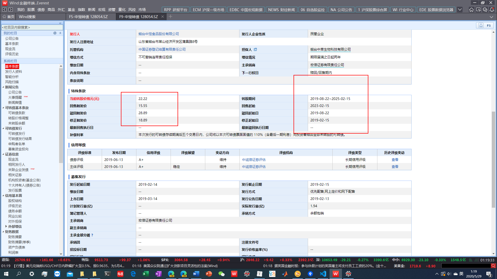
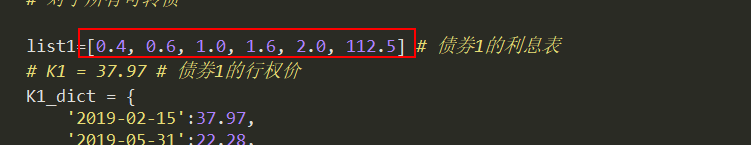
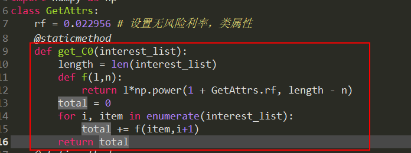
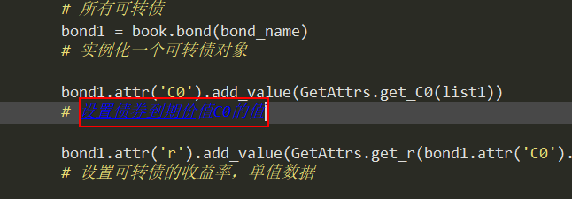
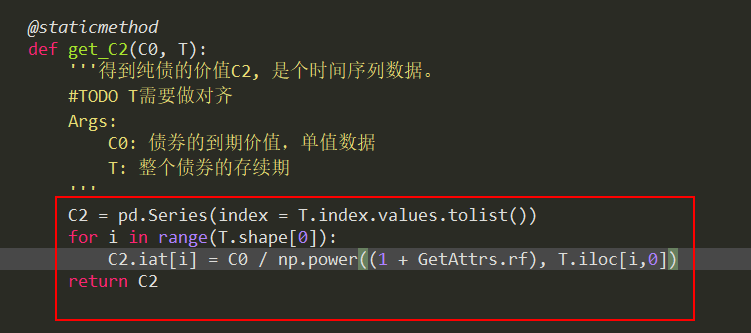

# Convertible_Bond.py
## 计算可转债的纯债价值，期权价值。


|                           函数结构                           |  注释  |
| :----------------------------------------------------------: | :----: |
| [Convertible_Bond](https://github.com/FinTechNJU/Bond/blob/master/Convertible_Bond.py) | 主程序 |
| [Container](https://github.com/FinTechNJU/Bond/blob/master/Container.py) |  容器  |
| [Adapter](https://github.com/FinTechNJU/Bond/blob/master/Adapter.py) | 适配器 |
| [Function](https://github.com/FinTechNJU/Bond/blob/master/Function.py) |  函数  |


------


|                      5.27日完成的任务                       |
| :---------------------------------------------------------: |
| p1 和 p2 都是计算可转债的期权价值和PV的。实现的效果是一样的 |
|  **book.bond(bond_name).attribute(C1).value() 是期权价值**  |
|    **book.bond(bond_name).attribute(C2).value() 是PV**     |


|                     链接表格                      |
| :---------------------------------------------------------: |
|[可转债套利空间的示例](https://github.com/FinTechNJU/ConvertibleBond/blob/master/output/128054.SZ.csv)|
|[代码地址: 计算可转债价值和生成以下两个图片(折线图和散点图), 点击此链接](https://github.com/FinTechNJU/Bond/blob/master/p1.py)  |
|[打开图片有问题？ 点击获取我分享的免费VPN，适用于windows、macos和linux](https://github.com/FinTechNJU/Tutorial/issues/2)|


```python
正股股(Stock_Price)...转股价值(Value_Series)...折线图 
```

* ​       [Python交互图链接地址](https://fintechnju.github.io/Bond/output/StockPrice_ValueSeries.html) 

 ...转股价值(Value_Series)...折线图.png) 

```python
正股股(Stock_Price)...转股价值(Value_Series)...折线图   
```

 ...溢价率(y)...散点图.png) 

```python
       正股股价(x)...溢价率(y)...散点图               
```


要做的事情列表：

|                 5月29日 事情列表                  |
| :-----------------------------------------------: |
|                   ~~把rf改掉~~                    |
|        改第一个图当中跳跃的点 用Excel画图         |
|          把第一张图当中的上面的图拉下来           |
|              可转债价格y和股价x的图               |
|          我们设置90%转股价格点为 分界点           |
|        分界点前pv+期权 分界点后是股价+期权        |
| ~~行权价K我们选取不变的，后期再在时间序列上操作~~ |


------

## 问题列表

以下数据可以自动获得或者可以爬取吗？









* 我是这么计算终值的
* 现在我想得到在债券发行期内，指定时间点(某一天)的 纯债价值



* 纯债的价值C2
* 纯债的价值是递增的？？
* 是的。因为两个到期价值一样的债券，更快到期的，获利能力更强，应该价值越大。


